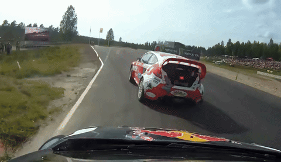

# PISCO: Precise Video Instance Insertion with Sparse Control

This repo hosts the official implementation of PISCO: Precise Video Instance Insertion with Sparse Control

[](https://arxiv.org/abs/2602.08277)
[](https://xiangbogaobarry.github.io/PISCO/)
[](https://github.com/XiangboGaoBarry/PISCO-Development-Tools)
[](https://huggingface.co/xiangbog/PISCO-14B/tree/main)
[](https://huggingface.co/xiangbog/PISCO-1.3B/tree/main)
<!-- [](https://github.com/taco-group/PISCO) -->


### Video Demos
<div align="center">

<h4>Instance Insertion</h4>

| | Example 1 | Example 2 |
| :---: | :---: | :---: |
| **Before** |  |  |
| **After** |  |  |

<h4>Creative</h4>

| | Example 1 | Example 2 |
| :---: | :---: | :---: |
| **Before** |  |  |
| **After** |  |  |

<h4>Reposition</h4>

| | Example 1 | Example 2 |
| :---: | :---: | :---: |
| **Before** |  |  |
| **After** |  |  |

<h4>Resize</h4>

| | Example 1 | Example 2 |
| :---: | :---: | :---: |
| **Before** |  |  |
| **After** |  |  |

<h4>Simulation</h4>

| | Example 1 | Example 2 |
| :---: | :---: | :---: |
| **Before** |  |  |
| **After** |  |  |

</div>

<br>


### TODO list

- [x] Release Inference Code
- [x] Release Development Tools
- [ ] Release Training Code
- [ ] Release Training Set

### Installation

```bash
conda create -n pisco python=3.12
conda activate pisco
# Install the correct version of torch
pip install torch==2.6.0 torchvision==0.21.0 torchaudio==2.6.0 --index-url https://download.pytorch.org/whl/cu124
pip install -r requirements.txt
# Install deepspeed if training 14B model
pip install deepspeed
```


### Inference

```bash
# 1.3B 480p
python inference/pretrained/infer_1.3B.py
# 1.3B 720p
python inference/pretrained/infer_1.3B_720p.py
# 14B 480p
python inference/pretrained/infer_14B.py
# 14B 720p
python inference/pretrained/infer_14B_720p.py
```


[](https://star-history.com/#taco-group/PISCO&Date)


### Acknowledgments

This repo is built upon the [Diffsynth-Studio](https://github.com/modelscope/DiffSynth-Studio) codebase. Thanks to the authors for their great work!