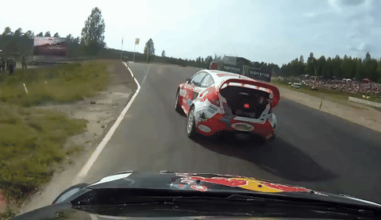
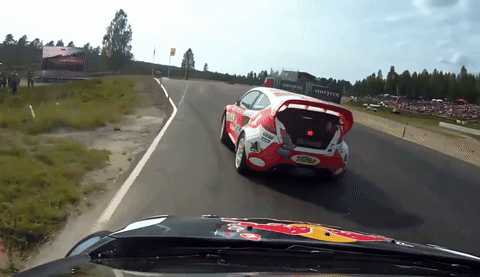

# PISCO: Precise Video Instance Insertion with Sparse Control

<h2 align="center">🎉 Accepted to NeurIPS 2026!</h2>

This repo hosts the official implementation of PISCO: Precise Video Instance Insertion with Sparse Control

[](https://arxiv.org/abs/2602.08277)
[](https://xiangbogaobarry.github.io/PISCO/)
[](https://github.com/XiangboGaoBarry/PISCO-Development-Tools)
[](https://huggingface.co/xiangbog/PISCO-14B/tree/main)
[](https://huggingface.co/xiangbog/PISCO-1.3B/tree/main)
[](https://huggingface.co/datasets/xiangbog/PISCO-Dataset)


### Video Demos
<div align="center">

<video src="assets/PISCO_demo.mp4" width="100%" controls autoplay loop muted></video>

<h4>Instance Insertion</h4>

| |  |  |
| :---: | :---: | :---: |
| **Before** |  |  |
| **After** |  |  |

<h4>Creative</h4>

| |  |  |
| :---: | :---: | :---: |
| **Before** |  |  |
| **After** |  |  |

<h4>Reposition</h4>

| |  |  |
| :---: | :---: | :---: |
| **Before** |  |  |
| **After** |  |  |

<h4>Resize</h4>

| |  |  |
| :---: | :---: | :---: |
| **Before** |  |  |
| **After** |  |  |

<h4>Simulation</h4>

| |  |  |
| :---: | :---: | :---: |
| **Before** |  |  |
| **After** |  |  |

</div>

<br>


### TODO list

- [x] Release Inference Code
- [x] Release Development Tools
- [x] Release Training Code
- [x] Release Training Set

### Installation

```bash
conda create -n pisco python=3.12
conda activate pisco
# Install the correct version of torch
pip install torch==2.6.0 torchvision==0.21.0 torchaudio==2.6.0 --index-url https://download.pytorch.org/whl/cu124
pip install -r requirements.txt
# Install deepspeed if training 14B model
pip install deepspeed
```


### Inference

```bash
# 1.3B 480p
python inference/pretrained/infer_1.3B.py
# 1.3B 720p
python inference/pretrained/infer_1.3B_720p.py
# 14B 480p
python inference/pretrained/infer_14B.py
# 14B 720p
python inference/pretrained/infer_14B_720p.py
```


### Training

PISCO is trained in three stages on top of VACE at 832×480 with 49 frames (Sec. 4.2 of the paper). The 14B model is a mixture of two denoisers that are trained independently with the same schedule: the high-noise expert on timesteps `[0, 0.358]`, the low-noise expert on `[0.358, 1]`.

| Stage | Trainable | LR | Script |
|---|---|---|---|
| I. Adapter input warm-up | new input projection of the VACE adapter (`pisco.pisco_patch_embedding`) | 1e-4 | `training/stage1/` |
| II. Adapter finetuning | full context adapter (`pisco`) | 2e-5 | `training/stage2/` |
| III. Joint finetuning | adapter + DiT backbone (`pisco,dit`) | 1e-5 | `training/stage3/` |

#### 1. Training data

The training set contains 20,590 samples: 11,816 synthetic scenes (`Env1`–`Env27`) and 8,774 real videos from VPData (`data_v2`). Every sample is six aligned 832×480 videos of 49 frames:

```
dataset/PISCO/
├── PISCO.json                                  # training index
└── <subset>/                                   # Env1 ... Env27, data_v2
    ├── <subset>_Unedited/<name>.mp4            # target video with the instance      -> video
    ├── <subset>_Edited/<name>.mp4              # background video, instance removed  -> pisco_video
    ├── <subset>_Masked/<name>.mp4              # spatial mask of the instance        -> pisco_video_mask
    ├── <subset>_Entity/<name>.mp4              # segmented instance                  -> pisco_reference_video
    ├── <subset>_Edited_Depth/<name>_viz.mp4    # depth of the background video       -> pisco_depth
    └── <subset>_Depth_Entity/<name>_viz.mp4    # depth of the segmented instance     -> pisco_reference_depth
```

Download it from [HuggingFace](https://huggingface.co/datasets/xiangbog/PISCO-Dataset) (36.6 GB of tar shards) and unpack it to `dataset/PISCO`:

```bash
huggingface-cli download xiangbog/PISCO-Dataset --repo-type dataset --local-dir PISCO-Dataset
mkdir -p dataset/PISCO
for f in PISCO-Dataset/shards/*.tar; do tar -xf "$f" -C dataset/PISCO; done
cp PISCO-Dataset/PISCO.json dataset/PISCO/
```

To train on your own data, arrange it the same way and build the index with

```bash
python utils/data_utils/generate_data_json.py --dataset_dir dataset/PISCO
```

During training the instance and depth conditions are kept only at randomly sampled keyframes, so the same samples cover single-keyframe, first/last-frame and dense control.

#### 2. Download base weights and initialize PISCO from VACE

```bash
huggingface-cli download Wan-AI/Wan2.1-T2V-1.3B --local-dir models/Wan-AI/Wan2.1-T2V-1.3B
huggingface-cli download Wan-AI/Wan2.1-VACE-1.3B --local-dir models/Wan-AI/Wan2.1-VACE-1.3B                # 1.3B
huggingface-cli download alibaba-pai/Wan2.2-VACE-Fun-A14B --local-dir models/PAI/Wan2.2-VACE-Fun-A14B      # 14B

python utils/checkpoints_init.py --model 1.3B       # writes models/PISCO/inits/
python utils/checkpoints_init.py --model 14B-low
python utils/checkpoints_init.py --model 14B-high
```

#### 3. Train

Logging uses Weights & Biases: set `WANDB_API_KEY`, or `WANDB_MODE=offline`.

```bash
# Stage I
bash training/stage1/PISCO-1.3B.sh
bash training/stage1/PISCO-14B-low-noise.sh
bash training/stage1/PISCO-14B-high-noise.sh

# Stage II: carry the latest stage-1 checkpoint over, then train
python utils/copy_to_next_stage.py --model 1.3B --stage 1
python utils/copy_to_next_stage.py --model 14B --noise low --stage 1
python utils/copy_to_next_stage.py --model 14B --noise high --stage 1
bash training/stage2/PISCO-1.3B.sh
bash training/stage2/PISCO-14B-low-noise.sh
bash training/stage2/PISCO-14B-high-noise.sh

# Stage III
python utils/copy_to_next_stage.py --model 1.3B --stage 2
python utils/copy_to_next_stage.py --model 14B --noise low --stage 2
python utils/copy_to_next_stage.py --model 14B --noise high --stage 2
bash training/stage3/PISCO-1.3B.sh
bash training/stage3/PISCO-14B-low-noise.sh
bash training/stage3/PISCO-14B-high-noise.sh
```

> Each stage resumes from the checkpoint in its own output folder (`--auto_load_checkpoints`). Do not skip `copy_to_next_stage.py`: without it the next stage silently starts again from the VACE initialization.

Preview intermediate checkpoints with `python inference/stage{1,2,3}/infer_1.3B.py [--step N]` (or `infer_14B.py`).

### Fine-tuning from PISCO

To adapt the released `xiangbog/PISCO-1.3B` / `xiangbog/PISCO-14B` checkpoints to your own insertion data (clean video, edited video, depth, and an instance cutout per sample), follow [`doc/finetune_setup.md`](doc/finetune_setup.md):

```bash
python utils/preprocess_data.py --dataset_dir Dataset/data --num_frames 21
python utils/generate_dataset_json.py --dataset_dir Dataset/data --repeat 10
CUDA_VISIBLE_DEVICES=0,1,2,3,4,5,6 bash training/finetune/PISCO-1.3B.sh   # or PISCO-14B.sh (DeepSpeed ZeRO-2)
```


[](https://star-history.com/#taco-group/PISCO&Date)


### Acknowledgments

This repo is built upon the [Diffsynth-Studio](https://github.com/modelscope/DiffSynth-Studio) codebase. Thanks to the authors for their great work!